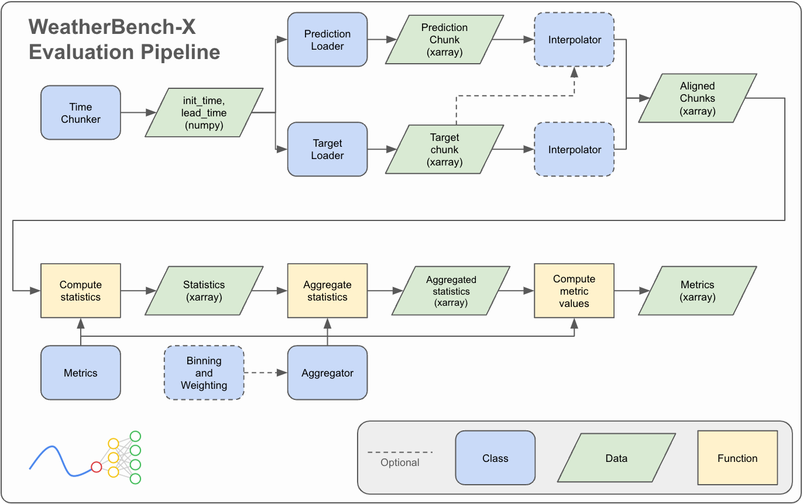

# API Reference



```{toctree}
:maxdepth: 3
api/time_chunks.md
api/data_loaders.rst
api/metrics.md
api/interpolations.md
api/binning.md
api/weighting.md
api/aggregation.md
api/beam_pipeline.md
```

